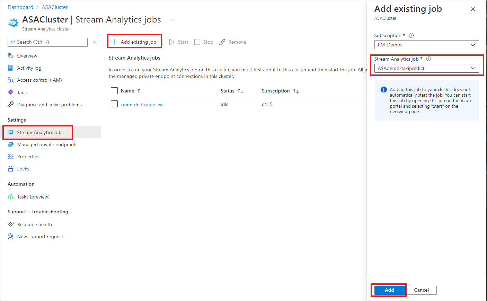
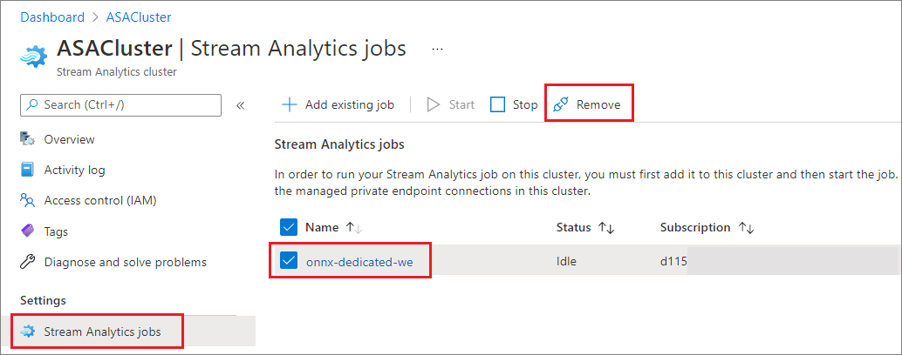

# Add and Remove jobs in an Azure Stream Analytics cluster

You can run multiple Azure Stream Analytics jobs on a Stream Analytics cluster. Running jobs on a cluster is a simple 2-step process: add the job to the cluster and start the job. This article shows you how to add and remove jobs from an existing cluster. Follow the quickstart to [create a Stream Analytics cluster](create-cluster.md) if you don't have one already.

## Add a Stream Analytics job to a cluster

Only existing Stream Analytics jobs can be added to clusters. Follow the quickstart to [learn how to create a job](stream-analytics-quick-create-portal.md) using the Azure portal. Once you have a job that you want to add to a cluster, use the following steps to add the job to your cluster.

1. In the Azure portal, locate and select your Stream Analytics cluster.

1. Under **Settings**, select **Stream Analytics jobs**. Then, select **Add existing job**.

1. Select the subscription and the Stream Analytics job you want to add to the cluster. Only Stream Analytics jobs that are in the same region as the cluster can be added to the cluster.

   

1. After you've added the job to the cluster, navigate to the job resource and [start the job](start-job.md#azure-portal). The job will then start to run on your cluster.

You can do all other operations, such as monitoring, alerting, and diagnostic logs, from the Stream Analytics job resource page.

## Remove a Stream Analytics job from a cluster

Stream Analytics jobs must be in a stopped state before it can be removed from the cluster. If your job is still running, stop the job before you move on to the following steps.

1. Locate and select your Stream Analytics cluster.

1. Under **Settings**, select **Stream Analytics jobs**.

1. Select the jobs you want to remove from the cluster, and then select **Remove**.

   

   When a job is removed from a Stream Analytics cluster, it returns to the standard multi-tenant environment.

## Next steps

You now know how to add and remove jobs in your Azure Stream Analytics cluster. Next, you can learn how to manage private endpoints and scale your clusters:

* [Scale an Azure Stream Analytics cluster](scale-cluster.md)
* [Manage private endpoints in an Azure Stream Analytics cluster](private-endpoints.md)
